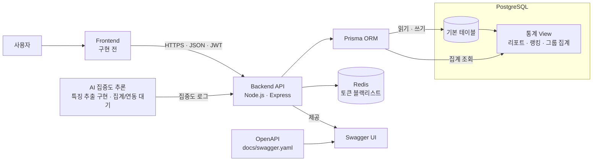

# FocusLens

FocusLens는 사용자의 집중 세션과 집중도 데이터를 기록·분석하고, 리포트·소셜·그룹 관리 기능을 제공하는 프로젝트다. 프런트엔드, AI, 백엔드를 하나의 저장소에서 관리하는 모노레포 구조를 사용한다.

## 구현 현황

| 영역 | 상태 | 설명 |
| --- | --- | --- |
| Backend | Phase 1~4 완료 + 연동 확장 | 38개 API, 로그 v2, Refresh Token, Roll-up, 보안·성능 검증 완료 |
| Frontend | 구현 전 | Git 추적 제품 소스와 빌드 설정이 없음 |
| AI | 부분 구현 | 웹캠 특징 추출·점수 함수·API 클라이언트 구현, 1분 집계·자동 전송 미구현 |

## 전체 프로젝트 아키텍처

### 런타임 구성


```mermaid
flowchart LR
    U[사용자] --> FE["Frontend<br/>구현 전"]
    FE -->|HTTPS · JSON · JWT| API["Backend API<br/>Node.js · Express"]
    AI["AI 집중도 추론<br/>특징 추출 구현 · 집계/연동 대기"] -->|집중도 로그| API

    API --> ORM[Prisma ORM]
    ORM -->|읽기 · 쓰기| TABLES
    ORM -->|집계 조회| VIEW
    subgraph DB[PostgreSQL]
        TABLES[(기본 테이블)] --> VIEW["통계 View<br/>리포트 · 랭킹 · 그룹 집계"]
    end
    API --> CACHE[("Redis<br/>토큰 블랙리스트")]
    SPEC["OpenAPI<br/>docs/swagger.yaml"] --> SWAGGER[Swagger UI]
    API -->|제공| SWAGGER
```

백엔드는 Phase 1~4를 완료했다. AI는 로컬 웹캠 특징 추출 프로그램까지 실행할 수 있지만 1분 집계와 API 자동 전송은 연결되지 않았고, 제품 프런트엔드는 구현 전이다. 클라이언트는 JWT 기반 HTTP API를 통해 데이터에 접근하고 데이터베이스에 직접 쓰지 않는다. 평균 집중도, 학습 시간, 반응 수, 랭킹과 같은 파생 값은 PostgreSQL View에서 계산한다. Phase 5를 제외한 AI·프런트 연동 대기 항목은 `docs/integration-readiness.md`를 따른다.

### 저장소 구조

```text
focusLens/
├── frontend/                        # 제품 프런트엔드 구현 대기
├── ai/                              # 웹캠 특징 추출 구현, 1분 집계·API 연결 대기
├── backend/                         # Express API 애플리케이션
│   ├── app.js                       # 미들웨어, 라우터, Health Check, Swagger UI
│   ├── server.js                    # HTTP 서버 진입점
│   ├── Dockerfile
│   ├── package.json                 # 백엔드 런타임·Prisma 의존성
│   └── src/
│       ├── routes/                  # API 경로·입력 검증·JWT 적용
│       ├── controllers/             # 도메인별 요청 처리와 비즈니스 로직
│       ├── middleware/              # 인증, 검증 결과, 전역 오류 처리
│       ├── models/prismaClient.js   # Prisma Client 싱글턴
│       ├── services/redis.js        # 토큰 블랙리스트와 Redis 연결
│       └── utils/focusScore.js      # 집중도 계산·평균·상태 판정
├── prisma/
│   ├── schema.prisma                # 도메인 16개와 Roll-up 3개 모델
│   ├── migrations/                  # DB 스키마·제약·View 마이그레이션
│   ├── views.sql                    # 통계 View 재적용 스크립트
│   └── seed.js                      # 개발용 시드 데이터
├── src/                             # Jest 테스트
│   ├── controllers/                 # 컨트롤러 단위 테스트
│   └── utils/                       # 실제 백엔드 유틸 단위 테스트
├── docs/                            # 기획, ERD, API, 보안, 운영 문서
│   └── swagger.yaml                 # Swagger UI가 사용하는 OpenAPI 단일 원본
├── .agents/                         # 개발 에이전트용 규칙과 워크플로
├── AGENTS.md                        # 프로젝트 공통 개발 규칙
├── docker-compose.yml               # API·PostgreSQL·Redis 실행 구성
├── package.json                     # 테스트와 DB 작업용 루트 명령
└── README.md
```

백엔드 요청은 `route → middleware → controller → Prisma/Redis` 순서로 처리된다. `prisma/`는 백엔드와 분리된 공용 데이터 계층이며 스키마, 마이그레이션, 통계 View, 개발용 시드를 관리한다. 루트 `src/`는 애플리케이션 소스가 아니라 백엔드 Jest 테스트 모음이다.

## Backend 실행 및 API 문서

로컬 실행 시 Node.js 20 이상이 필요하며, Docker 실행은 프로젝트의 Node.js 20 이미지를 사용한다.

```bash
docker compose up -d --build
```

- Swagger UI: `http://localhost:3000/api-docs/`
- OpenAPI JSON: `http://localhost:3000/api-docs/openapi.json`
- Health check: `http://localhost:3000/health`

Swagger UI의 `Authorize` 버튼에 로그인 응답의 `access_token`을 입력하면 보호된 API를 브라우저에서 직접 호출할 수 있다.
