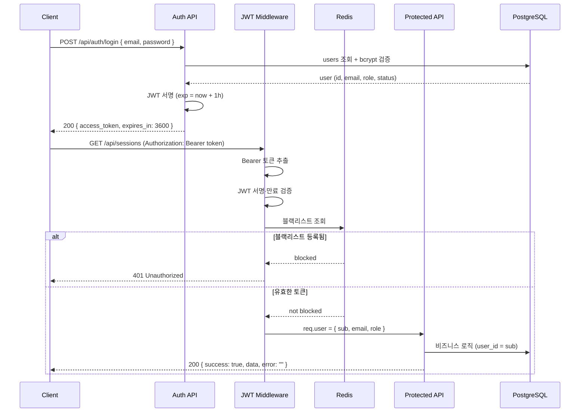
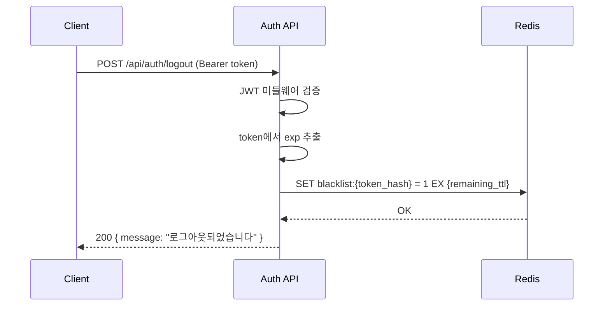
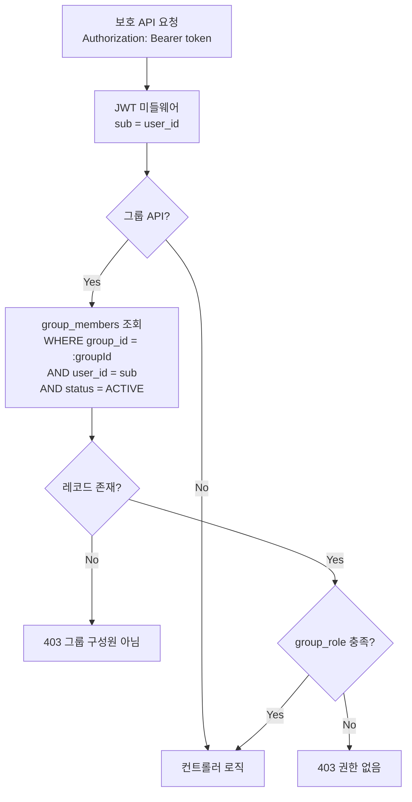
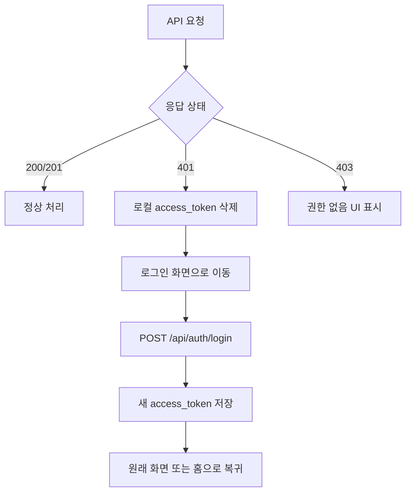

# FocusLens JWT 인증 흐름

> **기준 문서**: `docs/api-spec.md`, `docs/erd.md`  
> **인증 방식**: Access Token 기반 **Stateless** JWT  
> **토큰 만료**: 1시간 (`expires_in: 3600`)

---

## 1. 개요

FocusLens 백엔드는 서버 세션을 저장하지 않는 Stateless JWT 인증을 사용한다.  
클라이언트는 로그인(또는 회원가입) 시 발급받은 Access Token을 `Authorization` 헤더에 실어 보호 API를 호출한다.

| 항목 | 값 |
| --- | --- |
| 토큰 종류 | Access Token only (Refresh Token 미사용) |
| 전달 방식 | `Authorization: Bearer <access_token>` |
| 서명 알고리즘 | HS256 (환경변수 `JWT_SECRET`) |
| 만료 시간 | 1시간 |
| 로그아웃 | Redis 블랙리스트 등록 |

### 관련 ERD 테이블

| 테이블 | 인증에서의 역할 |
| --- | --- |
| `users` | `id`, `email`, `password_hash`, `role`, `status` — 로그인 검증 및 JWT payload 출처 |
| `group_members` | 그룹 API 권한 판단 (`group_role`, `status`) — JWT `sub`로 조회 |

---

## 2. JWT Payload 구조

Access Token 디코딩 시 포함되는 클레임:

```json
{
  "sub": "550e8400-e29b-41d4-a716-446655440000",
  "email": "user@example.com",
  "role": "USER",
  "iat": 1719475200,
  "exp": 1719478800
}
```

| 필드 | 타입 | 설명 |
| --- | --- | --- |
| `sub` | string (UUID) | `users.id` — API에서 **현재 사용자 식별자**로 사용 |
| `email` | string | `users.email` |
| `role` | string | `users.role` — 전역 권한 (`USER`, `ADMIN`) |
| `iat` | number | 발급 시각 (Unix timestamp) |
| `exp` | number | 만료 시각 (Unix timestamp, `iat` + 3600초) |

> `sub`는 JWT 표준 subject 클레임이며, FocusLens에서는 **`user_id`와 동일**하게 취급한다.  
> 보호 라우트·소유자 검증·그룹 권한 검증 모두 `req.user.sub`(또는 `req.user.id`)를 기준으로 한다.

---

## 3. 전체 인증 흐름



---

## 4. 단계별 흐름

### 4.1 로그인 → JWT 발급

**엔드포인트**: `POST /api/auth/login` (인증 불필요)

| 단계 | 처리 |
| --- | --- |
| 1 | 클라이언트가 `email`, `password` 전송 |
| 2 | 서버가 `users` 테이블에서 `email`로 사용자 조회 |
| 3 | `bcrypt`로 `password`와 `password_hash` 비교 |
| 4 | `users.status`가 `ACTIVE`인지 확인 (비활성 → 403) |
| 5 | payload `{ sub: users.id, email, role }` 로 JWT 서명, `exp` = 현재 + 1시간 |
| 6 | `{ access_token, expires_in: 3600 }` 응답 |

회원가입(`POST /api/auth/register`) 성공 시에도 동일한 방식으로 Access Token을 즉시 발급한다.

**실패 응답**

| 상태 | 상황 |
| --- | --- |
| 401 | 이메일·비밀번호 불일치 |
| 403 | `users.status` ≠ `ACTIVE` |

---

### 4.2 보호 라우트 요청

**예시**: `GET /api/sessions`, `POST /api/groups/:id/invite`

| 단계 | 처리 |
| --- | --- |
| 1 | 클라이언트가 헤더에 토큰 첨부: `Authorization: Bearer <access_token>` |
| 2 | JWT 미들웨어가 Bearer 토큰 추출 |
| 3 | 서명 검증 (`JWT_SECRET`) |
| 4 | `exp` 만료 여부 확인 |
| 5 | Redis 블랙리스트 조회 (아래 5절 참고) |
| 6 | 검증 통과 시 `req.user`에 payload 바인딩 → 다음 미들웨어/컨트롤러로 전달 |

**보호 라우트 적용 대상** (api-spec 기준)

- 인증 API: `POST /api/auth/logout` 외 전부
- 세션, 리포트, 소셜, 랭킹, 그룹 API 전체

**인증 불필요 라우트**

- `POST /api/auth/register`
- `POST /api/auth/login`

---

### 4.3 JWT 미들웨어 검증

미들웨어는 아래 순서로 검증한다. **하나라도 실패하면 401**을 반환하고 컨트롤러까지 진행하지 않는다.

```
1. Authorization 헤더 존재 여부
2. "Bearer " prefix 및 토큰 문자열 추출
3. jwt.verify(token, JWT_SECRET) — 서명·exp 검증
4. Redis GET blacklist:{token_hash} — 블랙리스트 확인
5. req.user = { sub, email, role } 설정 → next()
```

**401 응답 예시**

```json
{
  "success": false,
  "data": {},
  "error": "인증 토큰이 필요합니다."
}
```

```json
{
  "success": false,
  "data": {},
  "error": "토큰이 만료되었습니다."
}
```

---

### 4.4 리소스 소유자 검증 (401 vs 403)

JWT 검증(401)과 **리소스 권한**(403)은 별도 단계다.

| 검증 | 기준 | 실패 |
| --- | --- | --- |
| 인증 | 유효한 JWT + 블랙리스트 미등록 | **401** |
| 세션 소유 | `sessions.user_id` = JWT `sub` | **403** |
| 그룹 역할 | `group_members.group_role` (아래 6절) | **403** |

**예: 집중도 로그 저장** (`POST /api/sessions/:id/log`)

```
JWT sub → sessions.id = :id 조회 → sessions.user_id === sub ?
  YES → 로그 저장
  NO  → 403 "해당 세션에 대한 권한이 없습니다"
```

현재 `ai/`에는 JWT를 전달받아 위 로그 API를 호출하는 Python 클라이언트 코드가 있다. 다만 웹캠 측정 루프와 연결되지 않았으며 자동 로그인·토큰 갱신도 구현되지 않았다. 실제 AI 측 자동 전송의 인증 흐름은 `docs/backend-plan.md` Phase 4 통합 검증 대상으로 남아 있다.

---

## 5. 로그아웃 — Redis 블랙리스트

FocusLens는 Refresh Token을 사용하지 않으므로, 로그아웃 시 **현재 Access Token을 Redis 블랙리스트에 등록**하여 만료 시각까지 재사용을 차단한다.

**엔드포인트**: `POST /api/auth/logout` (인증 필요)

### 처리 흐름



| 단계 | 처리 |
| --- | --- |
| 1 | JWT 미들웨어로 토큰 유효성 확인 |
| 2 | 토큰 문자열(또는 jti)의 해시로 Redis 키 생성: `blacklist:{sha256(token)}` |
| 3 | TTL = `exp - now` (남은 만료 시간). 이미 만료된 토큰은 등록 생략 가능 |
| 4 | 이후 동일 토큰으로 요청 시 미들웨어 4단계에서 **401** 반환 |

### Redis 키 설계

| 항목 | 값 |
| --- | --- |
| Key | `blacklist:{sha256(access_token)}` |
| Value | `1` (또는 로그아웃 시각) |
| TTL | JWT `exp`까지 남은 초 — **토큰 만료 후 자동 삭제** |

> 블랙리스트 TTL을 `exp`와 맞추면, 만료된 토큰은 Redis에서도 자동 정리되어 저장 공간을 절약한다.

---

## 6. 그룹 API — JWT sub → group_members 권한 검증

ERD 및 api-spec 원칙: **그룹 권한은 `group_members.group_role` 기준**.  
`groups.created_by_user_id` 단독으로 OWNER/MANAGER 여부를 판단하지 않는다.

### 검증 흐름



### SQL 조회 예시

```sql
SELECT id, group_role, status
FROM group_members
WHERE group_id = :groupId
  AND user_id = :userId   -- JWT sub
  AND status = 'ACTIVE';
```

| 단계 | 설명 |
| --- | --- |
| 1 | JWT 미들웨어에서 `sub` 추출 → `user_id` |
| 2 | Path의 `:id`(group_id)와 `user_id`로 `group_members` 조회 |
| 3 | `status = ACTIVE` 확인 — 없으면 **403** |
| 4 | API별 필요 `group_role` 확인 |

### API별 group_role 요구사항

| API | 허용 group_role |
| --- | --- |
| `POST /api/groups/:id/invite` | `OWNER`, `MANAGER` |
| `PATCH /api/groups/:id/members/:memberId` | `OWNER` |
| `POST /api/groups/:id/goals` | `OWNER`, `MANAGER` |
| `GET /api/groups/:id/goals` | `OWNER`, `MANAGER`, `MEMBER` |
| `POST /api/groups/:id/goals/:goalId/assignees` | `OWNER`, `MANAGER` |
| `POST /api/groups/:id/feedbacks` | `OWNER`, `MANAGER` |
| `GET /api/groups/:id/feedbacks` | `OWNER`/`MANAGER` 전체, `MEMBER`는 본인 대상만 |

### group_members.id가 필요한 경우

피드백·목표·초대 API는 `group_members.id`(member PK)를 body에 사용한다.  
이때도 **권한 판단은 JWT `sub` → `group_members.user_id` 조회**로 수행한다.

```
JWT sub
  → group_members WHERE group_id AND user_id = sub
  → group_members.id  (manager_member_id / created_by_member_id 등에 저장)
  → group_members.group_role IN (OWNER, MANAGER) ?
```

> `groups.created_by_user_id === sub` 이어도 `group_role ≠ OWNER`이면 권한 거부(**403**).

---

## 7. 토큰 만료 시 클라이언트 처리

Access Token 만료(1시간) 또는 무효 토큰 시 서버는 **401**을 반환한다. Refresh Token이 없으므로 **재로그인**이 필요하다.

### 서버 응답

```json
{
  "success": false,
  "data": {},
  "error": "토큰이 만료되었습니다."
}
```

### 클라이언트 처리 권장



| 단계 | 클라이언트 동작 |
| --- | --- |
| 1 | API 응답 **401** 수신 |
| 2 | 저장된 `access_token` 삭제 (localStorage / secure storage) |
| 3 | 사용자에게 세션 만료 안내 |
| 4 | 로그인 화면으로 리다이렉트 |
| 5 | `POST /api/auth/login`으로 재인증 |
| 6 | 새 토큰 저장 후 이전 작업 재시도(선택) |

### 401 vs 403 구분

| 상태 | 의미 | 클라이언트 처리 |
| --- | --- | --- |
| **401** | 미인증·만료·로그아웃된 토큰 | 토큰 삭제 → **재로그인** |
| **403** | 인증됐으나 권한 없음 | 재로그인 불필요, 권한 안내 UI |

---

## 8. 환경변수

| 변수 | 설명 |
| --- | --- |
| `JWT_SECRET` | JWT 서명 비밀키 |
| `JWT_EXPIRES_IN` | 예시 값 `1h` — Access Token 만료 (미설정 시 코드 기본값도 `1h`) |
| `REDIS_URL` | 블랙리스트 저장용 Redis 연결 |

---

## 9. 구현 체크리스트

- [✅] `backend/src/middleware/auth.js` — JWT 서명·만료 검증 + Redis 블랙리스트 확인
- [✅] `backend/src/controllers/groupsController.js` — JWT `sub`로 `group_members` 조회 및 `group_role` 검증 (별도 `groupAuth.js` 미들웨어 없음)
- [✅] 세션·리포트·공유 컨트롤러 — `sessions.user_id`와 JWT `sub` 일치 검증 (별도 `sessionOwner.js` 미들웨어 없음)
- [✅] `POST /api/auth/logout` — Redis `SET blacklist:{hash} EX ttl`
- [✅] 보호 라우트 전체에 auth 미들웨어 적용
- [ ] Phase 4에서 그룹 권한·세션 소유자 우회 시나리오 통합 검증
