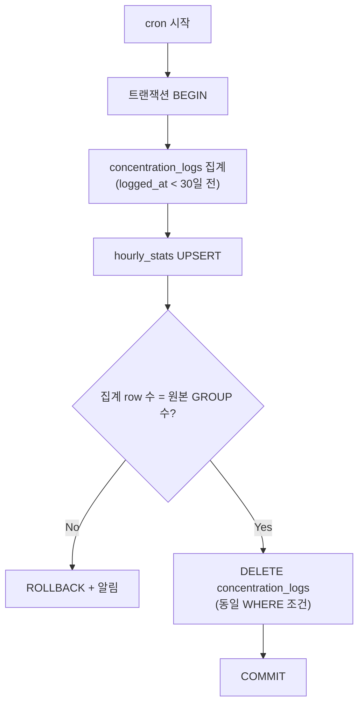

# FocusLens Roll-up 전략

> **기준 문서**: `docs/erd.md`  
> **목적**: `concentration_logs` 분 단위 원본 데이터의 장기 보관 비용 절감 및 조회 성능 유지  
> **실행 시점**: Phase 4 (테스트 및 고도화) — `docs/backend-plan.md` 참고

---

## 1. 개요

FocusLens는 학습 세션마다 **분 단위** `concentration_logs`를 저장한다. 데이터가 누적되면 저장·조회 비용이 증가하므로, **30일이 지난 원본**을 시간 단위 집계 테이블로 압축한 뒤 원본을 삭제한다.

현재 `ai/`는 웹캠 프레임별 특징 추출 단계이며 1분 집계와 자동 API 전송이 연결되지 않았다. 이 문서는 AI 로그 유입 이후의 데이터 보관 전략을 정의하며, roll-up 테이블과 스케줄러 역시 아직 구현되지 않았다.

추가로 `hourly_stats` → `daily_stats` → `weekly_stats` 단계적 압축을 통해 장기 보관 구간의 row 수를 줄인다.

| 구분 | 대상 | Roll-up | 물리 삭제 |
| --- | --- | --- | --- |
| 집중도 원본 | `concentration_logs` | ✅ | ✅ (hourly 집계 확인 후) |
| 집중도 집계 | `hourly_stats`, `daily_stats`, `weekly_stats` | ✅ (상위 tier로) | ✅ (상위 tier 집계 확인 후) |
| 소셜 | `session_shares`, `session_reactions` | ❌ | ❌ (소프트 딜리트만) |
| 세션·리포트 | `sessions`, `reports` | ❌ | ❌ |

> ERD 원칙: `sessions`에 `avg_focus_score`, `duration_seconds` 저장 금지 — 집계 값은 roll-up 테이블 또는 조회 시 계산.

---

## 2. 대상 테이블 — concentration_logs

ERD 정의 (분 단위 원본):

| 컬럼 | 설명 |
| --- | --- |
| `id` | PK (UUID) |
| `session_id` | FK → `sessions.id` |
| `logged_at` | 분 단위 타임스탬프 |
| `gaze_score`, `blink_score`, `head_score`, `focus_score` | 0~100 float |
| `attention_state`, `face_detected` | 상태 플래그 |

**UNIQUE**: `(session_id, logged_at)`

Roll-up **대상 컬럼** (집계):

- `gaze_score`, `blink_score`, `head_score`, `focus_score` → `AVG`
- 레코드 수 → `COUNT(*)` as `log_count`

> `attention_state`, `face_detected`는 hourly 이상 tier에서 별도 집계하지 않음. 상세 타임라인이 필요한 **최근 30일** 구간은 원본 `concentration_logs`로 조회.

---

## 3. 압축 단계

```
concentration_logs (분)
        │  logged_at > 30일
        ▼
  hourly_stats (시간)
        │  bucket_start > 90일
        ▼
  daily_stats (일)
        │  bucket_start > 365일
        ▼
  weekly_stats (주)
```

| 단계 | 소스 | 대상 | 시간 버킷 |
| --- | --- | --- | --- |
| 1 | `concentration_logs` | `hourly_stats` | `date_trunc('hour', logged_at)` |
| 2 | `hourly_stats` | `daily_stats` | `date_trunc('day', bucket_start)` |
| 3 | `daily_stats` | `weekly_stats` | `date_trunc('week', bucket_start)` |

### 3.1 집계 테이블 공통 스키마 (권장)

각 tier는 동일한 집계 컬럼 구조를 사용한다.

| 컬럼 | 타입 | 설명 |
| --- | --- | --- |
| `id` | UUID | PK |
| `session_id` | UUID | FK → `sessions.id` |
| `bucket_start` | timestamptz | 버킷 시작 시각 (hour / day / week) |
| `avg_gaze_score` | float | `AVG(gaze_score)` |
| `avg_blink_score` | float | `AVG(blink_score)` |
| `avg_head_score` | float | `AVG(head_score)` |
| `avg_focus_score` | float | `AVG(focus_score)` |
| `log_count` | int | 집계에 포함된 원본 로그 수 |
| `created_at` | timestamptz | 집계 생성 시각 |

**UNIQUE 권장**: `(session_id, bucket_start)` — tier별 테이블마다 적용

### 3.2 단계별 집계 SQL 예시

**분 → 시간** (`concentration_logs` → `hourly_stats`)

```sql
INSERT INTO hourly_stats (
  id, session_id, bucket_start,
  avg_gaze_score, avg_blink_score, avg_head_score, avg_focus_score,
  log_count, created_at
)
SELECT
  gen_random_uuid(),
  session_id,
  date_trunc('hour', logged_at) AS bucket_start,
  AVG(gaze_score),
  AVG(blink_score),
  AVG(head_score),
  AVG(focus_score),
  COUNT(*),
  NOW()
FROM concentration_logs
WHERE logged_at < NOW() - INTERVAL '30 days'
GROUP BY session_id, date_trunc('hour', logged_at)
ON CONFLICT (session_id, bucket_start) DO UPDATE SET
  avg_gaze_score   = EXCLUDED.avg_gaze_score,
  avg_blink_score  = EXCLUDED.avg_blink_score,
  avg_head_score   = EXCLUDED.avg_head_score,
  avg_focus_score  = EXCLUDED.avg_focus_score,
  log_count        = EXCLUDED.log_count;
```

**시간 → 일**, **일 → 주**도 동일 패턴으로 `hourly_stats` / `daily_stats`를 소스로 집계한다.

---

## 4. 실행 주기

| 항목 | 값 |
| --- | --- |
| **스케줄러** | cron (node-cron 또는 OS cron) |
| **실행 시각** | **매일 자정** (`0 0 * * *`, Asia/Seoul 기준 팀 설정) |
| **잡 이름** | `rollup-concentration-logs` |

### 4.1 단일 cron 잡 처리 순서

```
00:00 cron 시작
  │
  ├─ 1) concentration_logs → hourly_stats  (30일 초과)
  ├─ 2) hourly_stats → daily_stats         (90일 초과)
  └─ 3) daily_stats → weekly_stats         (365일 초과)
```

각 단계는 **독립 트랜잭션**으로 실행하며, 이전 단계 실패 시 후속 단계는 중단하고 알림을 발송한다.

---

## 5. 트리거 조건

### 5.1 concentration_logs → hourly_stats

| 조건 | 표현 |
| --- | --- |
| 기준 컬럼 | `logged_at` |
| 트리거 | `logged_at < NOW() - INTERVAL '30 days'` |

**최근 30일** 데이터는 분 단위 원본을 유지하여 세션 상세 API(`GET /api/sessions/:id`) 타임라인 품질을 보장한다.

### 5.2 hourly_stats → daily_stats

| 조건 | 표현 |
| --- | --- |
| 기준 컬럼 | `bucket_start` |
| 트리거 | `bucket_start < NOW() - INTERVAL '90 days'` |

### 5.3 daily_stats → weekly_stats

| 조건 | 표현 |
| --- | --- |
| 기준 컬럼 | `bucket_start` |
| 트리거 | `bucket_start < NOW() - INTERVAL '365 days'` |

> 90일·365일 임계값은 Phase 4 성능 테스트 후 조정 가능. `concentration_logs` 30일 규칙은 backend-plan 확정 기준.

---

## 6. 집계 항목

`session_id` + 시간 버킷(`bucket_start`) 단위로 아래를 산출한다.

| 집계 항목 | SQL | 저장 컬럼 |
| --- | --- | --- |
| Gaze 평균 | `AVG(gaze_score)` | `avg_gaze_score` |
| Blink 평균 | `AVG(blink_score)` | `avg_blink_score` |
| Head 평균 | `AVG(head_score)` | `avg_head_score` |
| Focus 평균 | `AVG(focus_score)` | `avg_focus_score` |
| 로그 수 | `COUNT(*)` | `log_count` |

**GROUP BY**: `session_id`, `bucket_start`

---

## 7. 원본 삭제 정책 — 트랜잭션

`concentration_logs` 원본은 **hourly_stats 집계가 완료·검증된 후에만** 삭제한다.  
집계 INSERT와 원본 DELETE는 **하나의 DB 트랜잭션**으로 처리하여 부분 실패 시 데이터 유실을 방지한다.

### 7.1 concentration_logs 삭제 흐름



### 7.2 트랜잭션 의사 코드

```javascript
await prisma.$transaction(async (tx) => {
  // 1. 대상 원본 범위 고정
  const cutoff = subDays(new Date(), 30);

  // 2. hourly_stats 집계 INSERT ... ON CONFLICT UPDATE
  const aggregated = await tx.$executeRaw`... INSERT INTO hourly_stats ...`;

  // 3. 집계 건수 검증 (session_id + hour 버킷 수 일치)
  const sourceBuckets = await tx.$queryRaw`... COUNT DISTINCT ...`;
  const targetRows = await tx.$queryRaw`... COUNT ...`;
  if (sourceBuckets !== targetRows) throw new Error('Roll-up verification failed');

  // 4. 검증 통과 후에만 원본 삭제
  await tx.$executeRaw`
    DELETE FROM concentration_logs
    WHERE logged_at < ${cutoff}
  `;
});
```

### 7.3 상위 tier 삭제 (hourly → daily → weekly)

동일 원칙 적용:

| 단계 | 삭제 대상 | 삭제 조건 |
| --- | --- | --- |
| hourly → daily | `hourly_stats` | `daily_stats` UPSERT + 건수 검증 **후** 트랜잭션 내 DELETE |
| daily → weekly | `daily_stats` | `weekly_stats` UPSERT + 건수 검증 **후** 트랜잭션 내 DELETE |

> **집계 확인 없이 원본을 삭제하지 않는다.**

---

## 8. 조회 전략 (API 연동)

세션 리포트·주간 요약 API는 기간에 따라 데이터 소스를 선택한다.

| 조회 기간 | 데이터 소스 |
| --- | --- |
| 최근 30일 (분 단위 타임라인) | `concentration_logs` |
| 30일 ~ 90일 | `hourly_stats` |
| 90일 ~ 365일 | `daily_stats` |
| 365일 이상 | `weekly_stats` |
| 세션 요약 (`reports.summary_json`) | `reports` 테이블 (세션 종료 시 스냅샷) |

> `v_user_session_summaries` View는 roll-up 테이블과 `concentration_logs`를 UNION하는 형태로 확장 가능.

---

## 9. 소셜 데이터 보관 정책

`session_shares`, `session_reactions`는 **Roll-up 대상이 아니며**, 스케줄러에 의한 **물리 삭제(HARD DELETE)를 수행하지 않는다.**

### 9.1 session_shares

ERD 컬럼: `deleted_at`, `status`

| 정책 | 내용 |
| --- | --- |
| 사용자 삭제 | `deleted_at` 설정 + `status = REMOVED` (소프트 딜리트) |
| cron 물리 삭제 | **없음** |
| 피드 조회 | `deleted_at IS NULL AND status = ACTIVE` 조건으로 필터 |

### 9.2 session_reactions

ERD 컬럼: `created_at` (물리 `deleted_at` 없음)

| 정책 | 내용 |
| --- | --- |
| 반응 취소 | API 레벨 DELETE (선택 구현) 또는 유지 — **roll-up cron과 무관** |
| cron 물리 삭제 | **없음** |
| 장기 보관 | 소셜 기록으로 **영구 보관** (용량 모니터링 후 아카이브 검토) |

### 9.3 소셜 vs 집중도 데이터 비교

```mermaid
flowchart LR
  subgraph Roll-up 대상
    CL[concentration_logs]
    HS[hourly_stats]
    DS[daily_stats]
    WS[weekly_stats]
    CL --> HS --> DS --> WS
  end

  subgraph 소셜 — 물리 삭제 없음
    SS[session_shares<br/>deleted_at 소프트 딜리트]
    SR[session_reactions<br/>장기 보관]
    SS --- SR
  end
```

---

## 10. 모니터링 및 장애 대응

| 항목 | 기준 |
| --- | --- |
| 잡 성공률 | 매일 1회 성공 필수 |
| 집계 검증 실패 | Slack/CloudWatch 알림, ROLLBACK 후 수동 재실행 |
| 삭제 row 수 | 집계 `log_count` 합계와 DELETE row 수 로그 기록 |
| 소셜 테이블 | row 수 추이 모니터링 (물리 삭제 없으므로 증가 추세 정상) |

### 재실행

- cron 실패 시 **동일 cutoff 조건**으로 수동 트리거 가능 (`POST /internal/jobs/rollup` — Phase 4)
- `ON CONFLICT DO UPDATE`로 멱등성(idempotent) 보장

---

## 11. 구현 체크리스트

- [ ] `hourly_stats`, `daily_stats`, `weekly_stats` migration 추가
- [ ] `(session_id, bucket_start)` UNIQUE 인덱스
- [ ] `concentration_logs(logged_at)` 인덱스 — 30일 cutoff 쿼리 최적화
- [ ] `src/jobs/rollupConcentrationLogs.js` — cron + 트랜잭션 roll-up
- [ ] 집계 건수 검증 로직
- [ ] 소셜 테이블 roll-up/cron DELETE **미포함** 확인
- [ ] Phase 4 수동 트리거 테스트 (`backend-plan.md` Phase 4)
